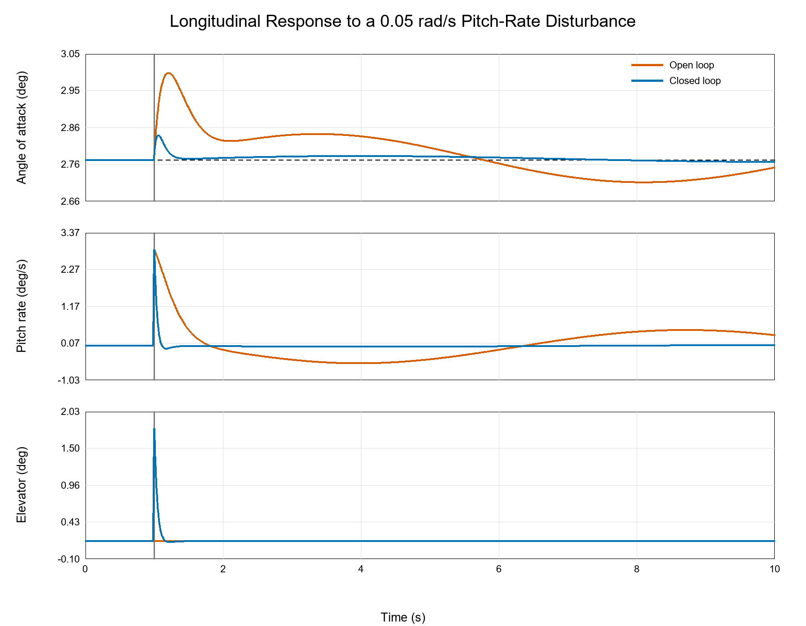

# longitudinal-flight-control-simulation
2D longitudinal aircraft dynamics simulation with closed-loop angle-of-attack control

# Aircraft Longitudinal Dynamics and Flight Control Simulation

This project models a representative 5 kg aircraft in two-dimensional longitudinal flight and compares its natural response with a closed-loop angle-of-attack controller. This project requires Python 3.10 or a newer version.

## Features
- Six nonlinear states: horizontal position, altitude, horizontal and vertical velocity, pitch angle, and pitch rate
- Lift, drag, gravity, body-aligned thrust, and aerodynamic pitching moment
- A consistent steady, level trim solver for angle of attack, elevator deflection, and thrust
- Proportional angle-of-attack feedback with pitch-rate damping and elevator saturation
- Fourth-order Runge–Kutta integration
- Automated gain search over 130 controller configurations
- Open-loop and closed-loop disturbance comparison
- Numerical linearization and closed-loop eigenvalue analysis
- Nine off-design cases spanning 12–18 m/s and 0.025–0.10 rad/s pitch-rate disturbances
- Time-step convergence testing at 20, 10, and 5 ms

## Model Assumptions
The aerodynamic derivatives are representative assumed values and should not be presented as data from a specific aircraft. The model assumes rigid-body longitudinal motion, constant air density, no actuator dynamics, no sensor noise, and no lateral-directional coupling. A logical future extension would replace the assumed coefficients with wind-tunnel, CFD, or published aircraft data and evaluate robustness to parameter uncertainty and sensor noise.

## Control Approach
A proportional controller commands elevator deflection based on angle-of-attack error.
Closed-loop response is analyzed following a pitch-rate disturbance and compared to
trimmed flight behavior.

## Results

The nominal simulation represented steady, level flight at 15 m/s. A 0.05 rad/s pitch-rate disturbance was applied at 1 second to compare the aircraft’s open-loop response with its closed-loop angle-of-attack controller.

| Performance Metric | Open Loop | Closed Loop | Improvement |
|---|---:|---:|---:|
| Peak absolute AoA error | 0.227° | 0.064° | 71.8% reduction |
| RMS AoA error | 0.0655° | 0.00957° | 85.4% reduction |
| 2% settling time | 7.61 s | 0.11 s | 98.6% reduction |
| Additional elevator demand | 0° | 1.62° | Within ±17.2° limit |

The controller gains were selected through an automated search of 130 gain combinations. Compared with the open-loop response, the selected controller reduced peak angle-of-attack error by 71.8%, RMS tracking error by 85.4%, and 2% settling time from 7.61 seconds to 0.11 seconds.

Controller robustness was evaluated across nine off-design cases spanning trim speeds of 12–18 m/s and pitch-rate disturbances of 0.025–0.10 rad/s. All nine cases settled within 0.20 seconds. The worst-case peak angle-of-attack error was 0.182°, while the maximum additional elevator demand was 3.25°, remaining well within the imposed ±17.2° actuator limit.

The nonlinear model was numerically linearized about its 15 m/s trim condition. All four eigenvalues of the closed-loop dynamic system had negative real parts, indicating local asymptotic stability. The least-stable eigenvalue real part was −0.0918 s⁻¹.

Numerical convergence was evaluated using integration time steps of 20, 10, and 5 milliseconds. The 20 ms and 5 ms simulations differed by only 0.057% in predicted peak angle-of-attack error and 0.119% in RMS error, demonstrating that the reported response was not meaningfully affected by the selected integration step.

These results are specific to the simulated aircraft model and its representative aerodynamic derivatives. They should be interpreted as simulation-based controller performance rather than experimentally validated aircraft performance.

## Response Comparison

